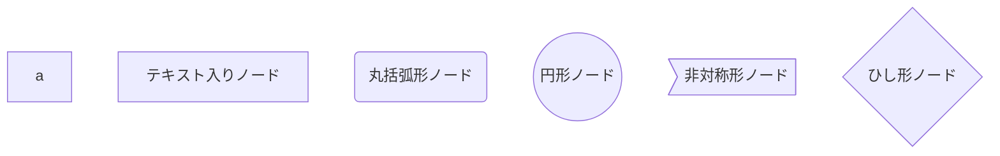
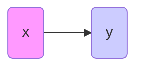
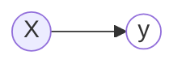
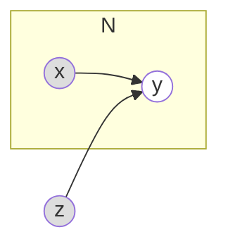

<!--
title:   グラフィカルモデルをmermaid.jsを使って良い感じに書きたいんだけど...
tags:    mermaid,mermaid.js,グラフィカルモデル,ベイズ推定
id:      8d3ec75a56da5a9492bc
private: false
-->
# はじめに
最近、Bayesian Approachによる回帰モデルを活用する機会が有り、その際にグラフィカルモデルを描きたいと思ったんですが、どんなツールで書くべきか迷ってしまいました。
一方で世の中にはmermaid.jsというものがあり、「最近githubでmermaid記法を使えるようになった！」という話題をtwitterで目にしたので、「mermaid.jsを使えば楽にグラフィカルモデルを書けるのでは？」という考えに至りました。
本記事では、グラフィカルモデルをmermaid.jsで描く為に使えそうなtipsをまとめました：）
# グラフィカルモデルって例えばこんな感じ
例えばこんな感じのグラフィカルモデルを書きたいんです。

# mermaid.js でノードの形を変更する
括弧を使い別ける事で、ノードの形を変更できるようです。

こんな感じになるようです。

なお、グラフィカルモデルにおいては、基本的には円形ノードを使っていきます。

# mermaid.js でノードの色を変更する

CSS の記法(?)が使えるようです。

こんな感じになります。

また、**ClassDef を使う事で、複数のノードに同一のテーマを適用できる**ようですね。`ノード名:::クラス名`と記述します。

なおグラフィカルモデルにおいては、観測されていない確率変数は塗りつぶさず、観測されている確率変数は塗りつぶして表します。なので、ClassDef で観測変数と見観測変数のスタイルをそれぞれ定義して、使い分けたいです。
(ちなみに既知の定数は塗りつぶした点で表します。)
なので例えば、

# 繰り返しのノードを枠で囲む

サブグラフを用いれば、特定のノードを枠で囲める様ですね。
例えばこんな風に。

# おわりに
とりあえずこれで何とか、グラフィカルモデルっぽい図は書けそうな気がします。(気がするだけで、実際には決して最適解ではないと思います...!)
皆さんはグラフィカルモデルをどうやって書いてるのでしょうか？オススメのツール等があればぜひコメント等で教えていただければ嬉しいです：）
draw.io等で手書きすべきなのかー。
# 参考
- 【目的無しの泥臭調査⑤】mermaid.jsの記法を覚えて、楽しく図を描く。
  - https://qiita.com/t_o_d/items/ac5b04419252f768a535
- Mermaid のテーマ・スタイルの変更方法
  - https://zenn.dev/junkawa/articles/zenn-mermaidjs-theme-config
- CSS カラーコード
  - http://www.netyasun.com/home/color.html